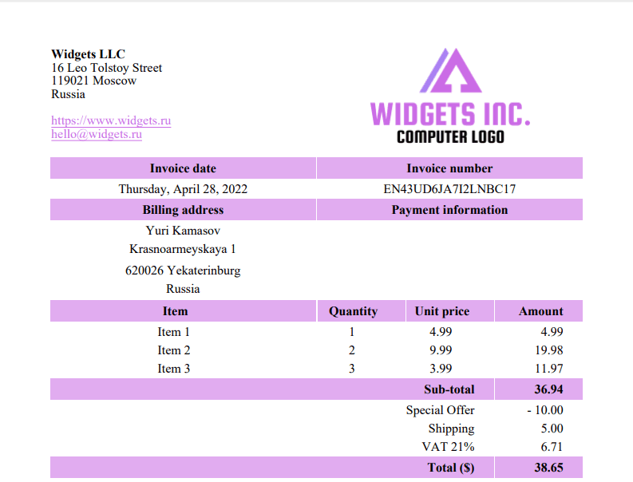

# The pigeon invoice

The pigeon invoice package helps you create html and pdf invoices.
Customize and localize using the `Twig` template engine and `Dompdf`.



## features

- pdf / html invoice
- includes discount and tax
- customize using `Twig` template engine
- localizable

## demo

- git clone the project
- `composer install`
- `php demo.php`
- check result in `invoice.pdf` / `invoice.html`

## install

```sh
composer require 8ctopus/pigeon-invoice
```

```php
use oct8pus\Invoice\Company;
use oct8pus\Invoice\Discount;
use oct8pus\Invoice\Invoice;
use oct8pus\Invoice\Person;
use oct8pus\Invoice\Shipping;
use oct8pus\Invoice\Tax;

require_once './vendor/autoload.php';

$locale = 'en';

$invoice = (new Invoice(__DIR__, __DIR__ . '/templates/', $locale))
    ->setSeller((new Company())
        ->setName('Widgets LLC')
        ->setWebsite('https://www.widgets.ru')
        ->setEmail('hello@widgets.ru')
        ->setStreet1('16 Leo Tolstoy Street')
        ->setZip('119021')
        ->setCity('Moscow')
        ->setCountry('Russia'))

    ->setBuyer((new Person())
        ->setFirstName('Yuri')
        ->setLastName('Kamasov')
        ->setStreet1('Krasnoarmeyskaya 1')
        ->setZip('620026')
        ->setCity('Yekaterinburg')
        ->setCountry('Russia'))

    ->setDate(new DateTime('28-04-2022'))
    ->setNumber('EN43UD6JA7I2LNBC17')
    ->setCurrency('$')

    // add items
    ->addItem((new Item())->setName('Item 1')->setPrice(4.99)->setQuantity(1))
    ->addItem((new Item())->setName('Item 2')->setPrice(9.99)->setQuantity(2))
    ->addItem((new Item())->setName('Item 3')->setPrice(3.99)->setQuantity(3))

    ->setDiscount((new Discount())->setName('Special Offer')->setPrice(10.00))

    ->setShipping((new Shipping())->setName('Shipping')->setPrice(5.00))

    ->setTax((new Tax())->setName('VAT')->setPercentage(0.21));

$html = $invoice->renderHtml();

file_put_contents('invoice.html', $html);

$pdf = $invoice->renderPdf();

file_put_contents('invoice.pdf', $pdf);
```

## Twig templates reference documentation

https://twig.symfony.com/doc/3.x/

## credits

- Dompdf https://github.com/dompdf/dompdf
- Twig https://github.com/twigphp/Twig
- logo https://www.canva.com/design

## clean code

```sh
vendor/bin/php-cs-fixer fix
```
